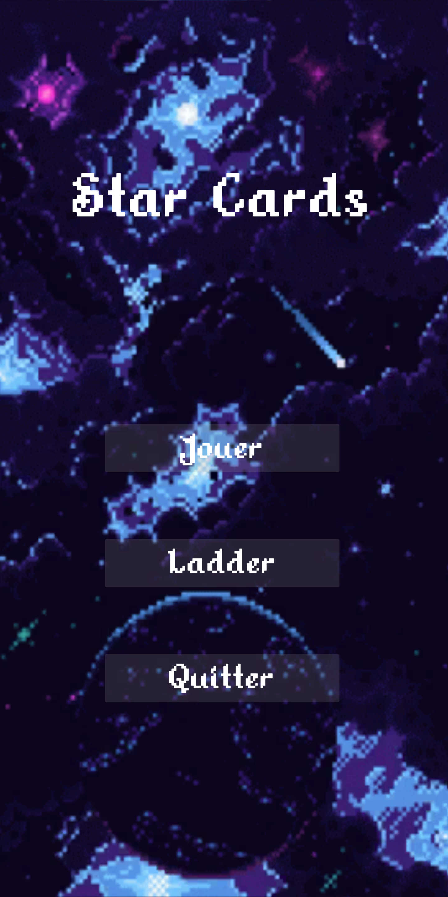
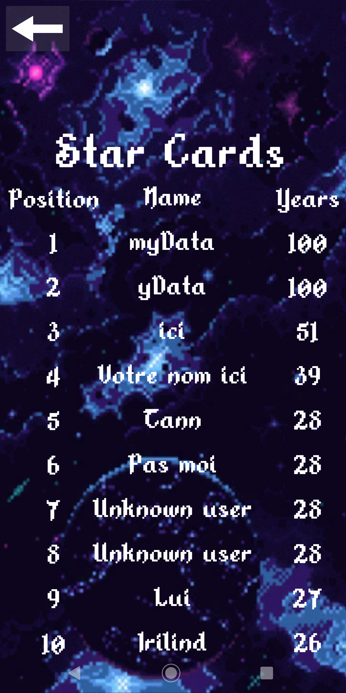
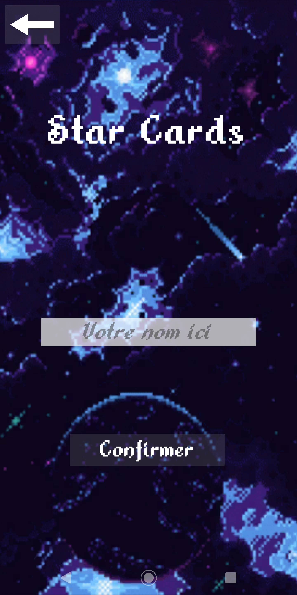
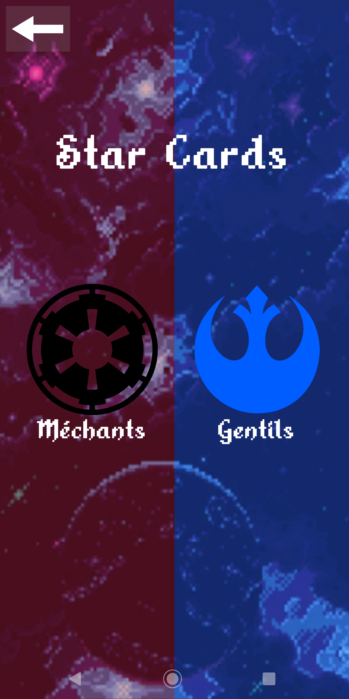
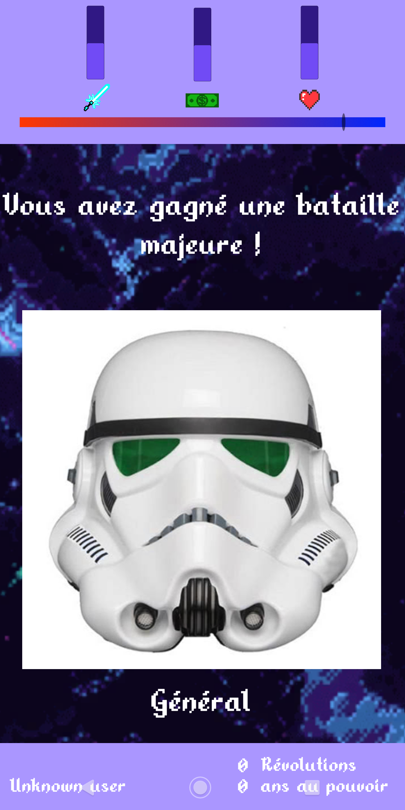
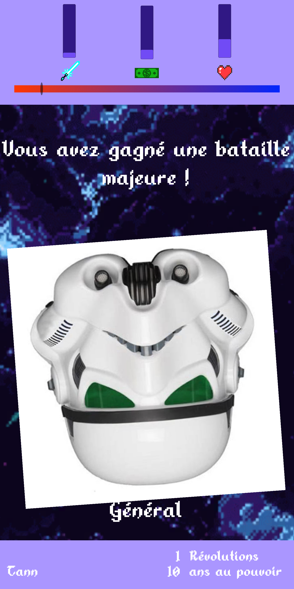
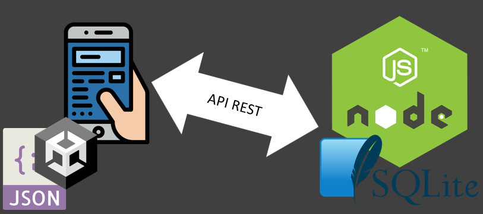

# Compte Rendu INFO701 Star Cards
#### Antoine DEPOISIER - M1 INFO 2022

## Fonctionnalités

Quand on arrive sur l'application, Il y a l'écran suivant comme menu :

<p align="center">
  
</p>

Le bouton quitter sert à quitter l'application, mais elle tourne toujours en arrière plan.

Quand on clique sur le bouton "Ladder", nous sommes redirigés vers la page du ladder, qui nous montre les 10 meilleurs joueurs du jeu. Une requête est envoyée à l'API quand on clique sur ce bouton et l'écran suivant est affiché :

<p align="center">
  
</p>

Le bouton "Jouer" nous redirige vers l'écran suivant :

<p align="center">
  
</p>

Avec cet écran, on choisit le nom du roi qui va régner. Si on ne choisit pas de nom, le nom du roi sera Unknown User.

Quand on confirme notre nom il y a l'écran suivant :

<p align="center">
  
</p>

Quand on appuie sur un des différents logos, nous sommes dirigés vers l'écran du jeu avec une barre d'influence dirigée vers les gentils si on choisit les gentils ou les méchants dans l'autre cas.

<p align="center">
  
</p>

Le jeu se déroule ensuite comme dans le jeu Reigns, avec une gestion des ressources et une barre d'influence. Cette barre d'influence permet d'avoir des histoires communes aux deux factions et des histoires uniques aux méchants. Par exemple, les méchants auront des histoires qui augmenteront principalement les ressources militaires, alors que les gentils ça sera la population. Ce n'est pas vraiment le cas, car je n'étais pas très inspiré lors de la création des histoires, mais c'était le but initial.

Nous pouvons voir en bas de l'écran le nom du souverain, le nombre d'années de règne et le nombre de révolutions disponibles.

Une révolution permet de changer de faction, et lors du changement de faction, les ressources militaires et de population sont changées pour être plus adéquates à la nouvelle faction. Une nouvelle révolution est disponible tous les 10 ans.

Pour déclencher une révolution, il faut avec nos deux doigts faire une rotation à la carte courante. Ça permet d'ignorer l'histoire courante (dans le cas où elle n'est pas à notre avantage pour le moment) et une animation de la carte tournante est déclenchée pendant 2 secondes.

<p align="center">
  
</p>

## Architecture

<p align="center">
  
</p>

Pour développer mon application j'ai décidé d'utiliser le moteur de jeu Unity.
Pour le serveur j'ai choisi d'utiliser un serveur NodeJS utilisant express pour créer une API communiquant avec une base de données SQLite.

Pour stocker les différentes histoires, j'ai décidé d'utiliser un JSON stocké sur l'application.

```json
{
    "stories" : [
            .
            .
            .
            {
            "id": 11,
            "isGood" : true,
            "imageCharacter": "Gouvernement",
            "story": "Johnny Hallyday est mort, le peuple cherche un responsable !",
            "leftChoice": "C'est le général !",
            "influenceLeft": -0.05,
            "moneyLeft": 0.0,
            "populationLeft": -0.10,
            "militaryLeft": 0.0,
            "storyLeft": {
                "id": 11,
                "imageCharacter": "Gouvernement",
                "story": "Le corps du général fût retrouvé sans vie 2 jours plus tard...",
                "leftChoice": "...",
                "influenceLeft": -0.07,
                "moneyLeft": 0.0,
                "populationLeft": 0.0,
                "militaryLeft": -0.07,
                "rightChoice": "...",
                "influenceRight": -0.07,
                "moneyRight": 0.0,
                "populationRight": 0.0,
                "militaryRight": -0.07
            },
            "rightChoice": "C'est le banquier !",
            "influenceRight": -0.05,
            "moneyRight": -0.10,
            "populationRight": 0.0,
            "militaryRight": 0.0,
            "storyRight": {
                "id": 11,
                "imageCharacter": "Gouvernement",
                "story": "Le corps du banquier fût retrouvé sans vie 2 jours plus tard...",
                "leftChoice": "...",
                "influenceLeft": 0.0,
                "moneyLeft": 0.0,
                "populationLeft": 0.0,
                "militaryLeft": 0.0,
                "rightChoice": "...",
                "influenceRight": 0.0,
                "moneyRight": 0.0,
                "populationRight": 0.0,
                "militaryRight": 0.0
            }
        },
        .
        .
        .
    ]
}
```

Les story possèdent un id pour pas qu'on ne tombe sur la même histoire avant 3 tours.

L'attribut isGood est facultatif. Il sert à dire que cette histoire ne peut être tirée que si l'on est plus proche des gentils que des méchants.

influenceLeft, moneyLeft, populationLeft, militaryLeft représentent l'évolution de nos ressources si ont fait le choix de gauche.

Pareil pour influenceRight, moneyRight, populationRight, militaryRight mais pour le choix de droite.

storyLeft et storyRight sont optionnels, dans les cas on l'on fait le choix de droite, cette histoire sera forcément à la suite, ça permet de faire des histoires sur plusieurs tours.

## Problèmes rencontrés

Je n'ai pas réussi à rendre l'application responsive sur tous les types d'écran. 
Le responsive fonctionne tant que l'on est en format portrait mais pas en format paysage.
J'ai testé le responsive en 16:9, 18:9 et 21:9 et ça marche en portrait.

## Améliorations possibles

* Ajout de sound effect et d'une musique d'ambiance

* Équilibrage des histoires, certaines histoires donnent ou retirent trop de ressources

* Changement de la carte courante plus agréable pour l'utilisateur

